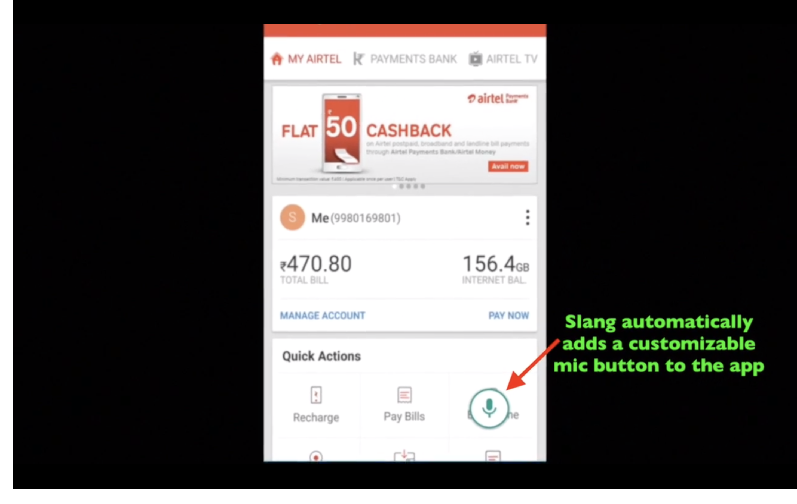

# airtelmock

This is a mocked version of the Airtel App built with the purpose of showing how to add a voice interface to this app

 

This app allows 3 primary functionality -

* Showing balance
  - Triggered by the user saying things like "Show my balance"
  
* Enable secure mode
  - Triggered by the user saying "Enable airtel secure"
  
* Enable roaming
  - Triggered by the user saying "Enable roaming" or "Enable international roaming" or "Enable international roaming for USA"
  
  
The app works by having "static" screenshots of the above functionality and the app switching to an activity which picks the appropriate screenshot to pick based on the functionaltiy triggered

The code that sets the "functionality" is in https://github.com/SlangLabs/airtelmock/blob/master/app/src/main/java/in/slanglabs/airtelmock/VoiceInterface.java

This is the main code that handles all the voice interactions. Demonstrates how to initialize slang and register for actions

The code has 2 parts

1. Initialize Slang

The code initialize Slang, where the user passes the required app/auth id and the languages to support. 

https://github.com/SlangLabs/airtelmock/blob/master/app/src/main/java/in/slanglabs/airtelmock/VoiceInterface.java#L32

Slang automatically puts up a "microphone" icon on all activities after this point

2. Register actions

This is the code to be triggered once Slang recognizes the intent of the user

-> The easiest intent is "balance" and the code for that is in

https://github.com/SlangLabs/airtelmock/blob/master/app/src/main/java/in/slanglabs/airtelmock/VoiceInterface.java#L149

-> "Roaming" is a mmore complicated intent (which has entities) and is handled here - 

https://github.com/SlangLabs/airtelmock/blob/master/app/src/main/java/in/slanglabs/airtelmock/VoiceInterface.java#L69

