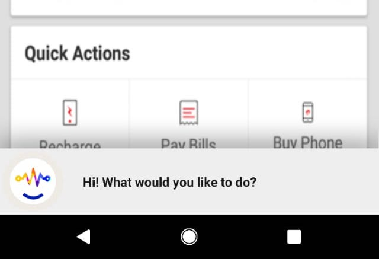

# airtelmock
This is a mocked version of the Airtel App built with the purpose of showing how to add a voice interface to this app

This app allows 3 primary functionality -

* Showing balance
  - Triggered by the user saying things like "Show my balance"
  
* Enable secure mode
  - Triggered by the user saying "Enable airtel secure"
  
* Enable roaming
  - Triggered by the user saying "Enable roaming" or "Enable international roaming" or "Enable international roaming for USA"
  
  
The app works by having "static" screenshots of the above functionality and the app switching to an activity which picks the appropriate screenshot to pick based on the functionaltiy triggered

The code that sets the "functionality" is in https://github.com/SlangLabs/airtelmock/blob/master/app/src/main/java/in/slanglabs/airtelmock/VoiceInterface.java

This is the main code that handles all the voice interactions. Demonstrates how to initialize slang and register for actions

